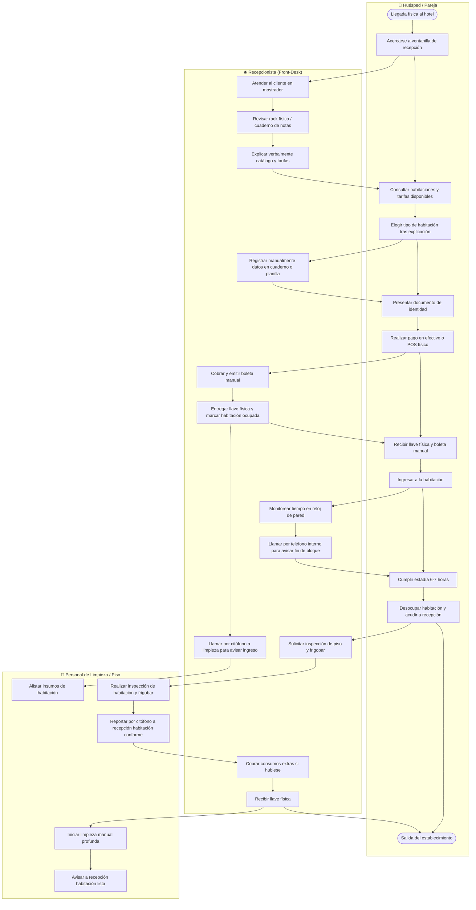
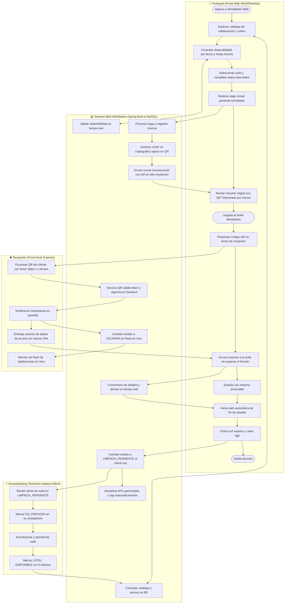
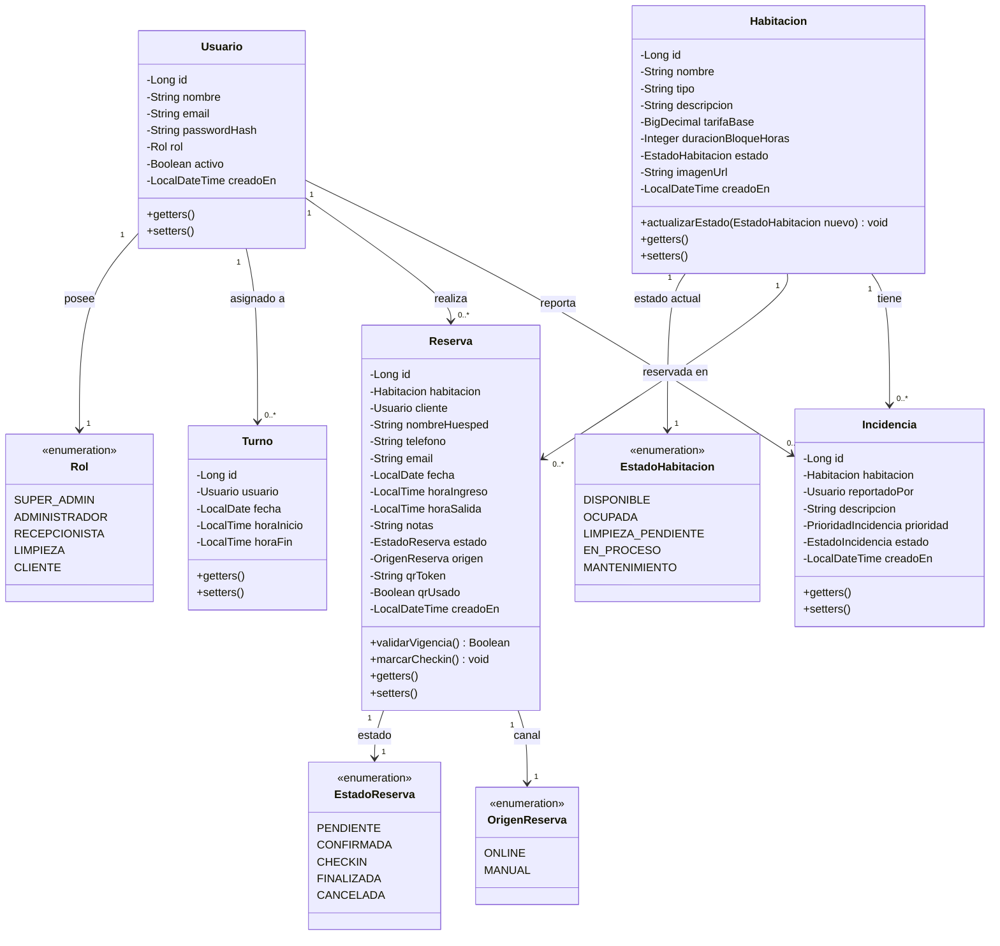
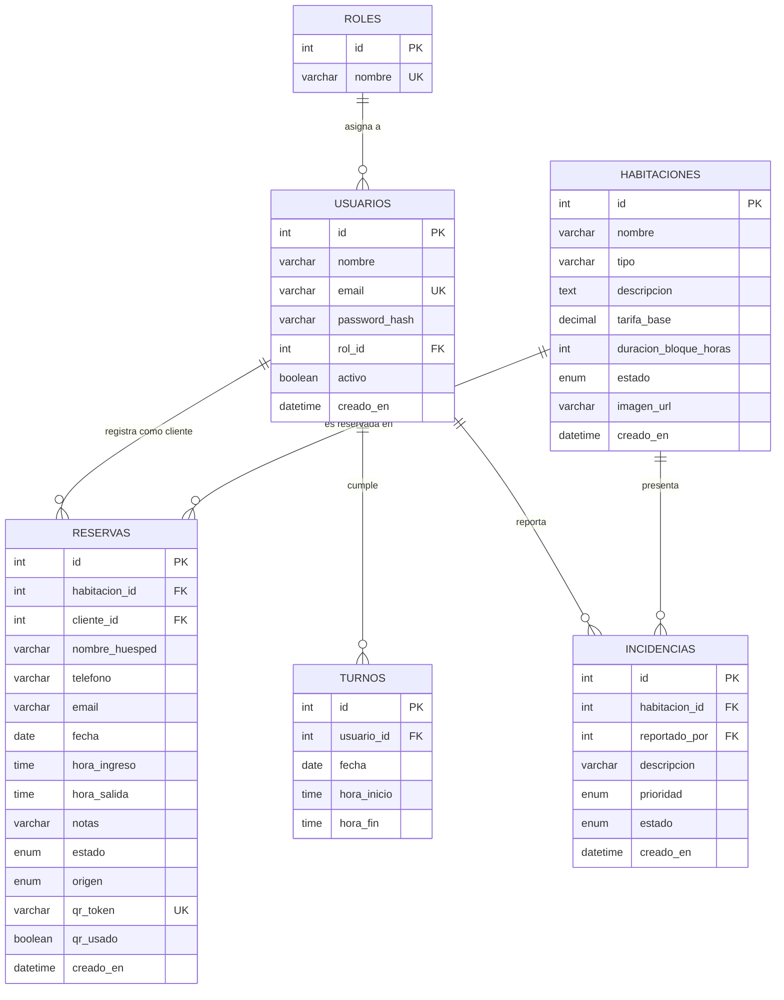

# UNIVERSIDAD TECNOLÓGICA DEL PERÚ
## FACULTAD DE INGENIERÍA
### CARRERA DE INGENIERÍA DE SOFTWARE

---

# “Sistema web de reservas y check-in digital para el Hotel Wimbledon (San Miguel, Lima)”

### INFORME DE PROYECTO INTEGRADOR — AVANCE 2
**CAPÍTULO 2: MARCO TEÓRICO**

**Integrantes:**
- Cerrón Muñoz, Vania Yolanda
- Effio Carrasco, Fernando Isaias
- Ganoza Zambrano, Juan Francisco
- La Madrid Lara, Fabiana Alessandra
- Sotelo Carpio, Sebastian Alejandro
- Villanueva Cordero, Jorge Luis

**Docente:**
- Ing. del Aguila Flores, Cristina Estephany

**Ciudad y Fecha:**
Lima – Perú, Septiembre de 2026

---

# CAPÍTULO 2: MARCO TEÓRICO

El presente capítulo expone los fundamentos teóricos, organizacionales, metodológicos y conceptuales que sustentan el diseño, modelado e implementación del sistema web de reservas y check-in digital para el Hotel Wimbledon. En concordancia con los estándares de ingeniería de software contemporáneos y las directrices de estilo APA 7ma edición, se establece la contextualización formal del negocio hotelero especializado en estadías cortas, la evolución de sus procesos manuales hacia arquitecturas digitales desacopladas, el modelado formal de procesos mediante la notación BPMN 2.0 (Business Process Model and Notation), y el marco conceptual riguroso que articula el paradigma de Programación Orientada a Objetos (POO) con los principios del modelo relacional de bases de datos.

---

## 2.1. Fundamento Teórico

La industria de la hospitalidad y los servicios de alojamiento turístico experimenta una transformación estructural impulsada por la digitalización de canales comerciales y la automatización de la experiencia del cliente (García Mendoza, 2025). En el ámbito específico de los establecimientos de estadía corta y hoteles temáticos para parejas en Lima Metropolitana, la dinámica operativa presenta desafíos singulares que difieren sustancialmente de la hotelería convencional de estancia prolongada. En estos recintos, la rotación de habitaciones ocurre en múltiples bloques horarios diarios (típicamente de 6 a 7 horas o pernocte nocturno), lo que demanda una sincronización milimétrica entre la asignación de habitaciones, el registro de ingresos, la liquidación en caja y el reacondicionamiento higiénico de las instalaciones (Zuñiga Peralta, 2023).

Desde la perspectiva de la Teoría General de Sistemas formulada por Ludwig von Bertalanffy, una organización hotelera opera como un sistema abierto y sociotécnico, compuesto por subsistemas interdependientes: el subsistema comercial y de reservas, el subsistema operativo de recepción, el subsistema de limpieza y mantenimiento (*housekeeping*) y el subsistema gerencial y financiero (Laudon & Laudon, 2020). En un entorno analógico o manual, la comunicación entre estos subsistemas se sustenta en canales sincrónicos de alta fricción (llamadas telefónicas internas, interfonos de pared, cuadernos físicos de recepción y órdenes verbales), generando asimetrías de información, retrasos operativos y un elevado riesgo de error humano.

Asimismo, la teoría de la calidad del servicio en entornos de hospitalidad postula que la satisfacción y fidelización del usuario no dependen únicamente de la infraestructura física del establecimiento, sino de la capacidad del sistema para reducir la fricción procedimental y salvaguardar los atributos de valor más sensibles para el cliente (Zeithaml et al., 2018). En el segmento de hospedaje íntimo de parejas, la discreción y la rapidez constituyen los dos pilares determinantes de la percepción de valor (Kandampully et al., 2018). La necesidad de aproximarse físicamente a una ventanilla de recepción, interactuar cara a cara con el personal para consultar tarifas y disponibilidad de suites temáticas, exponer verbalmente datos personales o documentos de identidad ante terceros, y esperar la entrega física de una llave, atenta de manera directa contra la intimidad y anonimato requeridos por el huésped. La adopción de Tecnologías de Autoservicio (*Self-Service Technologies* - SST), como el check-in digital mediante códigos QR tokenizados, permite reconfigurar radicalmente esta interacción, transfiriendo el control del proceso al usuario y reduciendo a cero el tiempo de espera no deseado (Bitner et al., 2002).

---

### 2.1.1. Reseña histórica de la empresa

El Hotel Wimbledon es una empresa peruana dedicada al rubro de servicios de hospedaje y entretenimiento para adultos y parejas, con una trayectoria consolidada de más de dos décadas de operación continua en Lima Metropolitana. El establecimiento se encuentra estratégicamente situado en la Av. Costanera 2098, en el distrito de San Miguel (a la altura de la cuadra 20 de la Av. La Paz), ubicación privilegiada en el litoral costero limeño que le otorga a gran parte de sus instalaciones una vista panorámica directa hacia el Océano Pacífico.

Desde su fundación a principios de la década del 2000, el Hotel Wimbledon se trazó como objetivo diferenciarse del concepto tradicional del hospedaje efímero, concibiendo sus instalaciones como un espacio donde convergen el confort hotelero de alto estándar, la arquitectura temática de vanguardia y la privacidad absoluta. Con una infraestructura que supera las 130 habitaciones acondicionadas y equipadas de manera individualizada, la empresa ha estructurado una de las ofertas temáticas más diversificadas del mercado peruano, abarcando 16 categorías diferenciadas por diseño, amenidades y niveles de sofisticación.

Entre sus habitaciones más emblemáticas destacan las Suites Presidenciales equipadas con cámaras secas (saunas), jacuzzis con sistemas de hidromasaje de última generación, camas circulares de alta densidad, sillones tántricos de cuarzo pulido y pistas de baile con barra de pole dance. Asimismo, cuenta con suites conceptuales como Tropical Dreams, Riverside Dreams (que incorpora vistas a ambientaciones acuáticas artificiales), Dark Fantasies, Venetian Flowers y Pacific Dreams, esta última con amplios ventanales orientados a la bahía de Lima. Una de las innovaciones arquitectónicas más valoradas por su clientela es la inclusión de cocheras privadas con acceso directo e independiente a la habitación, lo que permite el ingreso y salida vehicular sin que los ocupantes deban transitar por pasillos comunes ni aproximarse físicamente a áreas públicas de recepción.

En complemento a su oferta de hospedaje, el Hotel Wimbledon dispone de una infraestructura de hospitalidad integral operativa las 24 horas del día. Su división gastronómica cuenta con una cocina central que ofrece una carta de 21 platos elaborados a pedido, que incluye platos de fondo de alta cocina (Lomo Saltado al Wok, Milanesa Napolitana con Spaghetti al Pesto, Fetuccini Alfredo), bocadillos gourmet y piqueos para parejas (Piqueo Premium, Dropshot Chicken Tacos, Mini Hamburguesas de Res). Por su parte, la división de bar y minibar dispone de más de 70 referencias que abarcan destilados premium (Whiskies Johnnie Walker Etiqueta Negra y Roja, Vodka Absolut, Tequila José Cuervo, Jägermeister), espumantes y champagnes importados (Riccadonna Asti, Ruby y Rocca Del Forti), vinos nacionales e internacionales (Intipalka, Navarro Correa, Marqués de Riscal), cócteles de autor (Pisco Sour, Chilcano, Piña Colada) y artículos de confitería, cuidado íntimo y conveniencia.

**Tabla 1**  
*Ficha técnica e infraestructura corporativa del Hotel Wimbledon*

| Atributo Institucional | Detalle Corporativo |
| :--- | :--- |
| **Razón Comercial** | Hotel Wimbledon |
| **Ubicación Geográfica** | Av. Costanera 2098, San Miguel (Cdra. 20 Av. La Paz), Lima, Perú |
| **Capacidad Instalada** | Más de 130 habitaciones operativas las 24 horas, los 365 días del año |
| **Categorías de Habitación** | 16 tipos (Delux, Hawaian Dreams, Simple Jacuzzi, Suites Presidenciales, etc.) |
| **Instalaciones Especiales** | Jacuzzis con hidromasaje, saunas secas, pole dance, estacionamiento directo |
| **Servicios Complementarios** | Room service 24h, carta gourmet (21 platos), bar/minibar (+70 productos) |
| **Canales de Atención Actuales**| Recepción presencial física, citofonía interna, atención vía WhatsApp y teléfono |

*Nota.* Elaboración propia a partir de los datos operacionales del Hotel Wimbledon (2026).

#### Misión Institucional
Brindar a nuestros huéspedes una experiencia de hospedaje íntima, confortable, segura y absolutamente discreta, combinando instalaciones modernas de lujo, una variada oferta de habitaciones temáticas y un servicio hospitalario de excelencia operativa disponible de manera ininterrumpida las 24 horas del día.

#### Visión Estratégica
Consolidarse como el establecimiento boutique y temático líder en Lima Metropolitana en el segmento de estadías cortas y descanso de parejas, siendo reconocidos por la innovación continua en nuestros servicios digitales, la preservación irrestricta de la privacidad del huésped y los más elevados estándares de higiene y confort.

#### Valores Corporativos
La cultura organizacional del Hotel Wimbledon se fundamenta en cinco principios esenciales:
1. **Discreción y Confidencialidad:** Compromiso ético y tecnológico inquebrantable con la privacidad del cliente en cada interacción.
2. **Confort y Distinción:** Cuidado riguroso de cada detalle estético, higiénico y ambiental en las suites e instalaciones.
3. **Seguridad Integral:** Resguardo patrimonial y personal del huésped en sus instalaciones y vehículos.
4. **Excelencia en el Servicio:** Vocación de atención personalizada, empática y oportuna sin invadir el espacio personal.
5. **Innovación Continua:** Modernización permanente de sus procesos mediante la adopción de herramientas informáticas avanzadas.

A pesar de su éxito comercial y posicionamiento de marca, el Hotel Wimbledon enfrenta una limitación crítica en su arquitectura operativa: la dependencia persistente de métodos analógicos manuales para el control de disponibilidad, el registro de ocupación y el cobro en caja. Esta situación crea un desacople entre la alta calidad física de sus suites y la experiencia de llegada del cliente, motivando el desarrollo del presente proyecto de ingeniería de software orientado a la digitalización integral del flujo de reserva y acceso.

---

### 2.1.2. Definición del sistema

El proyecto denominado **Sistema Web de Reservas y Check-in Digital para el Hotel Wimbledon** se define formalmente como una solución informática distribuida, modular y transaccional, desarrollada bajo arquitectura web desacoplada, cuyo propósito primordial es automatizar y optimizar integralmente el ciclo de vida de la reserva, el control de acceso vehicular y peatonal, el monitoreo del estado de las habitaciones en tiempo real y la gestión operativa de limpieza del establecimiento.

De acuerdo con la clasificación de sistemas de información empresariales establecida por Pressman y Maxim (2021), el software propuesto conjuga las características de un Sistema de Procesamiento de Transacciones (*Transaction Processing System* - TPS) de alta concurrencia con las facultades de un *Property Management System* (PMS) ligero y especializado. El sistema no solo gestiona la persistencia de transacciones de reserva y recaudación financiera, sino que coordina en tiempo real los flujos de trabajo asíncronos entre los tres actores operativos del hotel: el cliente/huésped, el personal de recepción (*front-desk*) y el personal de limpieza y camarería de piso (*housekeeping*).

Desde la perspectiva funcional, el sistema se estructura en cuatro subsistemas o módulos principales:

a) **Módulo de Catálogo Dinámico y Consulta Pública:** Interfaz web responsive que expone la oferta de 16 tipos de suites temáticas, sus fichas técnicas detalladas (jacuzzi, sauna seca, pole dance, estacionamiento directo), galería fotográfica en alta definición y tarifas transparentes (desglosando el 18% de IGV y 5% de recargo al consumo). Permite la consulta de disponibilidad en tiempo real filtrando por fecha y franjas horarias específicas (bloques de 6 o 7 horas), garantizando que el usuario visualice únicamente suites efectivamente libres.

b) **Módulo de Reserva en Línea y Generación de Token Criptográfico:** Subsistema que gestiona la captura segura de datos del cliente, procesa la transacción de reserva con pago anticipado y genera de manera asíncrona un comprobante digital que incorpora un código QR tokenizado. Conforme al requerimiento no funcional de privacidad extrema, el código QR no codifica datos filiatorios ni información personal abierta del huésped, sino un Identificador Único Universal versión 4 (UUID v4) opaco e impredecible. Dicho token actúa como una llave de paso digital que solo puede ser resuelta y validada por el backend del sistema dentro de la franja horaria programada.

c) **Módulo de Recepción y Fast Check-in:** Aplicación web diseñada para el personal de mostrador que permite la validación instantánea del código QR mediante lectores ópticos bidimensionales o cámaras web. El sistema verifica el estado de la reserva, comprueba que la suite se encuentre desinfectada y lista, marca el ingreso en milisegundos y actualiza el Rack de Habitaciones en Vivo a estado `OCUPADA`. Adicionalmente, el módulo provee una agenda diaria que visualiza los ingresos del turno sin exponer historiales anteriores de los huéspedes, sosteniendo la promesa de confidencialidad del negocio.

d) **Módulo de Housekeeping y Control Operativo:** Interfaz móvil ligera para el equipo de limpieza que gestiona la máquina de estados de cada suite (`LIMPIEZA_PENDIENTE` -> `EN_PROCESO` -> `LISTA` / `DISPONIBLE`). Permite además el reporte instantáneo de incidencias técnicas o de mantenimiento físico (por ejemplo, fallas en bombas de hidromasaje o aire acondicionado), inhabilitando preventivamente la suite para reservas públicas hasta su subsanación.

En términos arquitecturales, la solución se diseñó siguiendo el modelo de separación de responsabilidades en capas. La capa de presentación cliente está construida como una *Single Page Application* (SPA) híbrida en JavaScript nativo moderno (ES Modules) y CSS3 Custom Properties con empaquetamiento bajo Vite 8, logrando tiempos de renderizado inmediatos sin sobrecarga de memoria en navegadores móviles. La capa de lógica del negocio y servicios se implementa en Java 17+ con el framework empresarial Spring Boot 3, asegurando los endpoints REST mediante Spring Security y tokens web JSON (JWT). Finalmente, la persistencia descansa sobre un motor relacional MySQL 8.x con motor transaccional InnoDB, asegurando la atomicidad y aislamiento de cada reserva concurrente.

---

### 2.1.3. Detalle de la secuencia de pasos del sistema manual

Para fundamentar con rigor de ingeniería la pertinencia del sistema automatizado propuesto, es indispensable desglosar y analizar de manera exhaustiva el procedimiento operativo vigente que se ejecuta actualmente de forma analógica y manual en el Hotel Wimbledon. Dicho procedimiento comprende una cadena de diez etapas secuenciales ejecutadas por el huésped, el recepcionista y el personal de piso:

- **Paso 1. Arribo físico y aproximación al local:** El cliente o pareja arriba al establecimiento situado en la Av. Costanera, ya sea por el ingreso vehicular con destino a las cocheras o por el acceso peatonal principal. En esta etapa preliminar, el cliente carece por completo de certidumbre sobre qué habitaciones temáticas específicas se encuentran disponibles, desocupadas o listas para su uso.
- **Paso 2. Interacción presencial e indagación en mostrador:** El cliente se aproxima físicamente a la ventanilla de recepción. Debe entablar una conversación directa con el recepcionista de turno para consultar qué suites tienen disponibilidad inmediata, cuáles son las tarifas vigentes por bloques de 6 o 7 horas y qué amenidades incorpora cada una (jacuzzi, sauna o pole dance).
- **Paso 3. Explicación verbal y exhibición de material físico:** El recepcionista procede a explicar verbalmente las características de las habitaciones, recurriendo en ocasiones a catálogos impresos, fotos plastificadas o folletos de mano. Este diálogo prolonga la permanencia del usuario en una zona visible y transitada, lo que resulta sumamente incómodo para huéspedes que priorizan la discreción.
- **Paso 4. Verificación manual en el Rack analógico de recepción:** Mientras el cliente espera frente a la ventanilla, el recepcionista revisa visualmente un rack de madera con tarjetas físicas o un cuaderno de apuntes manuscrito para verificar si la habitación solicitada ha sido liberada por el turno anterior. Si existe duda, el recepcionista debe marcar al citófono interno o comunicarse por radio portátil con el personal de limpieza de piso para confirmar si la suite ya fue desinfectada.
- **Paso 5. Registro manual de datos filiatorios y vehículo:** Una vez acordada la suite, el recepcionista solicita al cliente su Documento Nacional de Identidad (DNI) o carné de extranjería, así como la placa del vehículo en caso de ingreso por cochera. El recepcionista transcribe a mano los datos en un libro de actas físico o en una hoja de cálculo no centralizada, dejando la información privada a la vista de cualquier otro cliente o colaborador presente en recepción.
- **Paso 6. Liquidación y pago manual en mostrador:** El recepcionista calcula la tarifa correspondiente al bloque solicitado y cobra al cliente de forma presencial. El pago se efectúa en efectivo (lo que exige conteo de billetes, verificación de autenticidad y entrega de cambio físico) o mediante un terminal POS inalámbrico con ingreso de clave y firma de voucher físico, generando demoras adicionales en el mostrador.
- **Paso 7. Asignación de llave física y emisión de comprobante:** El personal de front-desk extrae del llavero mural la llave mecánica o tarjeta física correspondiente a la habitación elegida, emite manualmente una boleta o ticket de control interno y hace entrega de los mismos al cliente, indicándole verbalmente el número de piso y la ruta de acceso.
- **Paso 8. Traslado a la habitación e inicio de cómputo manual del tiempo:** El cliente se desplaza por los pasillos o ingresa con su vehículo a la cochera privada asignada. Al cerrar la ventanilla, el recepcionista anota manualmente en el cuaderno de turnos la hora exacta de ingreso (por ejemplo, 21:15 hrs) y calcula mentalmente la hora de salida correspondiente tras 6 horas (03:15 hrs), dependiendo del monitoreo visual de un reloj de pared para vigilar los vencimientos.
- **Paso 9. Gestión analógica de room service y consumos adicionales:** Durante la estadía, si la pareja desea solicitar bebidas de bar, artículos de minibar o platos de la carta gastronómica, debe descolgar el teléfono interno de la habitación y comunicarse con recepción. El recepcionista transcribe el pedido a mano en una comanda de papel, llama a la cocina o bodega, y despacha a un camarero para que entregue los productos en la puerta de la suite y cobre en efectivo en el acto o anote el cargo para el check-out.
- **Paso 10. Check-out manual, inspección de habitación y retiro:** Quince minutos antes del cumplimiento de las 6 o 7 horas, el recepcionista llama telefónicamente a la suite para advertir el término del bloque. Cuando el cliente abre la puerta para retirarse, recepción avisa por radio al personal de piso para que realice una inspección visual de la suite (revisión de sábanas, toallas y conteo de productos consumidos del frigobar). El camarero confirma por citófono a recepción que todo está conforme. Si existen consumos impagos, el cliente debe detenerse nuevamente en recepción para cancelar el saldo y devolver la llave física antes de abandonar el establecimiento.

**Tabla 2**  
*Matriz analítica de problemas, causas raíz, riesgos e impactos del sistema manual actual*

| Fase Operativa | Problema / Falla Observada | Causa Raíz Analítica | Riesgo Asociado | Impacto en el Negocio |
| :--- | :--- | :--- | :--- | :--- |
| **Llegada y Consulta** | Incertidumbre de suites disponibles y colas en ventanilla | Ausencia de canal digital público sincronizado en vivo | Operativo: pérdida de clientes por saturación en horas pico | Alto: fuga de ventas hacia competidores con reserva online |
| **Atención Front-desk** | Exposición visual e incomodidad del huésped | Obligatoriedad de interacción cara a cara para cotizar | Privacidad: transgresión a la reserva e intimidad del cliente | Crítico: deterioro de la reputación de confidencialidad |
| **Registro de Huésped** | Exposición de datos personales (DNI, placas) | Registro en cuaderno físico abierto y planillas dispersas | Legal y Reputacional: infracción a Ley 29733 de Protección de Datos | Crítico: contingencias legales y pérdida total de confianza |
| **Cobro en Caja** | Lentitud operativa y riesgos en manejo de efectivo | Cobro presencial mediante conteo físico y POS analógico | Financiero: descuadres de caja, billetes falsos y demoras | Medio-Alto: cuellos de botella severos en fines de semana |
| **Monitoreo de Tiempo** | Imprecisión en control de bloques (6 o 7 horas) | Cálculo mental del recepcionista y reloj de pared | Operativo: sobreestadías no facturadas y retrasos en turnos | Alto: merma directa en el índice de rotación de suites |
| **Check-out y Limpieza** | Llamadas por radio y demoras en inspección física | Falta de terminales móviles para el personal de piso | Operativo: habitaciones retenidas como sucias innecesariamente | Alto: habitaciones no disponibles a tiempo para nuevos huéspedes |

*Nota.* Elaboración propia a partir del levantamiento de procesos en el Hotel Wimbledon (2026).

---

### 2.1.4. Diagrama BPM

El estándar *Business Process Model and Notation* en su versión 2.0 (BPMN 2.0), mantenido por el Object Management Group (OMG, 2013), constituye el lenguaje gráfico de modelado de procesos de negocio más riguroso y universalmente aceptado en la ingeniería de software empresarial. Su propósito es brindar una notación comprensible tanto para los analistas de negocio y los usuarios operativos como para los arquitectos de software encargados de la implementación computacional.

Para evidenciar de forma concluyente la ventaja cuantitativa y cualitativa de la transformación digital planteada, se desarrollaron dos modelos formales BPMN 2.0: el diagrama del proceso actual en estado manual (As-Is) y el diagrama del proceso propuesto automatizado mediante el sistema web (To-Be).

#### Diagrama BPMN del Proceso Manual Actual (As-Is)
El modelo del proceso actual (Figura 1) delimita tres carriles de ejecución (*lanes*): el Huésped, el Recepcionista y el Personal de Limpieza/Piso. El flujo inicia con la llegada física del cliente al local. A lo largo de la secuencia, se identifican cuatro compuertas y cuellos de botella de alta fricción: (a) la consulta verbal de habitaciones sujetas a disponibilidad en recepción; (b) el registro manuscrito de datos personales en cuadernos abiertos; (c) el cobro físico en caja; y (d) la inspección analógica de salida coordinada vía interfono o radio portátil. Como se observa en la modelación, el cliente se ve obligado a interactuar en múltiples oportunidades con el personal, exponiendo su identidad y soportando tiempos muertos innecesarios.

**Figura 1**  
*Diagrama de procesos de negocio BPMN del sistema manual actual (As-Is)*

*Nota.* Elaboración propia mediante notación formal BPMN 2.0 representando las tres pistas de responsabilidad operativas.

#### Diagrama BPMN del Proceso Propuesto Automatizado (To-Be)
En contraposición, el modelo del proceso propuesto (Figura 2) reestructura integralmente la cadena de valor introduciendo el carril computacional del Sistema Web Wimbledon (Servicios Backend Spring Boot, Generador de Token QR y MySQL) y redefiniendo los carriles del Huésped, la Recepción Express y el Terminal Móvil de Limpieza (*Housekeeping*). En este nuevo flujo, el cliente efectúa la exploración de suites, la verificación de disponibilidad y el pago anticipado de forma virtual desde su dispositivo personal las 24 horas del día. El sistema procesa la transacción de manera asíncrona, genera un token UUID v4 opaco y envía el voucher digital con el código QR al correo electrónico del huésped.

Al arribar físicamente a las instalaciones, el cliente no requiere consultar disponibilidad ni llenar formularios: simplemente aproxima su código QR al lector óptico del front-desk. El servicio backend valida el token en menos de 500 milisegundos, confirma la validez de la reserva, marca la suite como `OCUPADA` en el Rack de Habitaciones en Vivo y entrega la llave o credencial de acceso express sin retener documentos. Durante la estancia, el cronómetro de la reserva notifica de forma automática y discreta a la interfaz web del usuario sobre la proximidad del término del bloque. Al ocurrir el check-out, el sistema actualiza automáticamente el estado de la habitación a `LIMPIEZA_PENDIENTE`, disparando una notificación instantánea en el dispositivo móvil del personal de limpieza, quienes acondicionan la suite y la marcan como `LISTA` con un solo toque en pantalla.

**Figura 2**  
*Diagrama de procesos de negocio BPMN del sistema web y check-in propuesto (To-Be)*

*Nota.* Elaboración propia mediante notación formal BPMN 2.0 evidenciando la orquestación síncrona y asíncrona de los servicios web.

**Tabla 3**  
*Comparación analítica de tiempos de ciclo y puntos de fricción: Proceso manual (As-Is) vs. Proceso propuesto (To-Be)*

| Dimensión de Evaluación | Proceso Manual Actual (As-Is) | Proceso Propuesto Web (To-Be) | Mejora Cuantitativa / Cualitativa |
| :--- | :--- | :--- | :--- |
| **Tiempo de Check-in en Local** | 12 a 20 minutos por cliente | Inferior a 45 segundos (Fast Check-in) | Reducción superior al 95% del tiempo de espera |
| **Disponibilidad de Información** | Nula antes de llegar al hotel | Consulta online 24/7 en tiempo real | Disponibilidad ubicua y transparente |
| **Privacidad y Confidencialidad** | Muy baja (exposición visual y verbal de DNI) | Máxima (Token QR cifrado sin datos abiertos) | Eliminación de fricción interpersonal e invasión |
| **Riesgo de Sobreventa (Overbooking)** | Alto (anotaciones cruzadas en papel) | Nulo (control de concurrencia y bloqueo en BD) | Integridad transaccional garantizada (ACID) |
| **Tiempo de Rotación de Limpieza** | 30 a 45 min por demoras de comunicación | 15 a 20 min con notificación móvil push | Aumento del 35% en capacidad de rotación diaria |
| **Manejo de Caja y Liquidación** | Cálculo mental manual y arqueos tardíos | Registro transaccional automático e instantáneo | Cero descuadres y auditoría en tiempo real |

*Nota.* Elaboración propia a partir de la simulación de tiempos operativos del Hotel Wimbledon (2026).

---

## 2.2. Marco Conceptual de POO y Base de Datos

La construcción de una solución de software empresarial de alto rendimiento requiere cimentarse sobre principios de diseño robustos, ampliamente contrastados en la disciplina de la ingeniería de software. A continuación, se detallan los fundamentos teóricos del paradigma de Programación Orientada a Objetos (POO) y de la teoría de Bases de Datos Relacionales, exponiendo su correspondencia exacta con el código fuente y el esquema del Hotel Wimbledon.

---

### 2.2.1. Paradigma de Programación Orientada a Objetos (POO)

El paradigma de Programación Orientada a Objetos es un modelo de desarrollo basado en la abstracción computacional de entidades del mundo real o conceptual bajo la forma de "objetos", los cuales integran un estado interno (datos representados por atributos) y un conjunto de comportamientos asociados (operaciones o métodos) que manipulan dicho estado (Booch et al., 2007). La POO promueve una alta cohesión interna en los módulos y un bajo acoplamiento entre ellos, garantizando que el software sea escalable, mantenible y reutilizable (Sommerville, 2016).

La arquitectura del backend de Hotel Wimbledon, desarrollada en Java con Spring Boot 3, implementa de forma estricta los cuatro pilares fundamentales de la orientación a objetos:

a) **Abstracción:** Consiste en identificar y modelar únicamente las características esenciales y el comportamiento relevante de un objeto dentro del contexto del negocio, omitiendo detalles accesorios o distractores (Booch et al., 2007). En nuestro sistema, el dominio hotelero se abstrajo en clases de entidad centrales: `Habitacion` (que abstrae el inventario físico, su tipo, tarifa base y amenidades), `Reserva` (que sintetiza el contrato de arrendamiento temporal, franja horaria y estado), `Usuario` (que modela a los colaboradores y huéspedes), `Turno` (que representa la jornada de guardia del personal) e `Incidencia` (que abstrae cualquier contingencia de mantenimiento).

b) **Encapsulamiento:** Es el mecanismo que restringe el acceso directo a los componentes internos de un objeto, protegiendo su estado contra modificaciones indebidas o inconsistentes desde el exterior (Pressman & Maxim, 2021). En la clase `Reserva`, todos los atributos (como `qrToken`, `estado`, `fecha` y `horaIngreso`) están declarados con visibilidad privada (`private`) y solo son mutables a través de métodos controlados como `marcarCheckin()`, el cual valida internamente las invariantes de negocio (por ejemplo, verifica que la reserva esté en estado `CONFIRMADA` y no haya sido utilizada previamente antes de transicionar a `CHECKIN`). Asimismo, en la entidad `Usuario`, el atributo `passwordHash` se encuentra estrictamente encapsulado y nunca es expuesto en los DTOs de respuesta.

c) **Herencia:** Permite la creación de nuevas clases basadas en clases preexistentes, heredando sus atributos y métodos, y promoviendo la reutilización de código y la extensibilidad (Booch et al., 2007). En la arquitectura del sistema, la herencia se manifiesta en múltiples niveles: a nivel de acceso a datos, todos los repositorios (`UsuarioRepository`, `HabitacionRepository`, `ReservaRepository`) heredan de la interfaz genérica `JpaRepository<T, ID>` de Spring Data, heredando métodos transaccionales CRUD completos (`save`, `findById`, `delete`); a nivel de seguridad, los servicios extienden de `UserDetailsService` para integrarse con el núcleo de Spring Security; y a nivel de manejo de fallos, las excepciones del sistema extienden de `RuntimeException`.

d) **Polimorfismo:** Es la capacidad de objetos pertenecientes a distintas clases de responder a un mismo mensaje o invocación de método de maneras diferentes y adaptadas a su tipo específico (Sommerville, 2016). En el sistema, el polimorfismo se aplica tanto por sobreescritura (`@Override`) como de forma paramétrica y dinámica. Un ejemplo destacado reside en el mecanismo de autenticación y autorización: el método `authenticate()` de `AuthenticationProvider` evalúa credenciales polimórficamente sin importar si el usuario posee rol `CLIENTE`, `RECEPCIONISTA` o `SUPER_ADMIN`. De igual forma, los servicios de exportación y notificación admiten el intercambio transparente de implementaciones (por ejemplo, el envío de códigos QR por correo electrónico mediante `JavaMailSender` o su extensión futura vía servicios de mensajería instantánea) respetando el mismo contrato funcional.

#### Principios de Diseño SOLID en la Arquitectura del Sistema
Los cinco principios SOLID, formulados por Robert C. Martin (2018), representan las directrices canónicas para la construcción de software orientado a objetos tolerante al cambio, comprensible y desacoplado. En el desarrollo del backend de Hotel Wimbledon, cada principio ha sido aplicado sistemáticamente:

**Tabla 4**  
*Correspondencia y aplicación de los principios SOLID en la arquitectura de software del sistema*

| Principio SOLID | Definición Formal (Martin, 2018) | Implementación en el Sistema Hotel Wimbledon |
| :--- | :--- | :--- |
| **S — Single Responsibility (Responsabilidad Única)** | Una clase debe tener una sola razón para cambiar, asumiendo una función bien delimitada. | Separación tajante: `ReservaService` gestiona la lógica de reservas, `ReservaConfirmacionService` genera el QR y correo, y `QrController` maneja peticiones HTTP. |
| **O — Open/Closed (Abierto / Cerrado)** | Las entidades de software deben estar abiertas a la extensión, pero cerradas a la modificación. | El servicio de validación de tokens admite nuevas fuentes de escaneo sin modificar el algoritmo criptográfico central de verificación de reservas. |
| **L — Liskov Substitution (Sustitución de Liskov)** | Los objetos de un programa deben poder ser sustituidos por instancias de sus subtipos sin alterar la corrección del sistema. | Cualquier implementación de repositorio que herede de `JpaRepository` puede sustituir a otra en entornos de prueba (ej. base H2 en memoria) sin alterar los servicios. |
| **I — Interface Segregation (Segregación de Interfaces)** | Los clientes no deben verse forzados a depender de interfaces o métodos que no utilizan. | Uso de DTOs segregados por rol: `HabitacionPublicaResponse` (huésped), `HabitacionLimpiezaResponse` (housekeeping) y `HabitacionAdminResponse` (gerencia). |
| **D — Dependency Inversion (Inversión de Dependencias)** | Los módulos de alto nivel no deben depender de los de bajo nivel; ambos deben depender de abstracciones. | Los controladores y servicios dependen exclusivamente de interfaces inyectadas por el contenedor IoC de Spring (`@Autowired` o constructores), no de clases concretas. |

*Nota.* Elaboración propia con base en Martin (2018) y el código fuente del proyecto Hotel Wimbledon.

#### Diagrama de Clases UML del Modelo de Dominio
El modelo de clases estructurado bajo el estándar Unified Modeling Language (UML) sintetiza la estructura estática del sistema de software. Como se ilustra en la Figura 3, el diagrama modela las clases principales del dominio empresarial (`Usuario`, `Rol`, `Habitacion`, `Reserva`, `Turno`, `Incidencia`) junto con sus atributos tipados, modificadores de visibilidad, operaciones clave y tipos enumerados (`EstadoHabitacion`, `EstadoReserva`, `OrigenReserva`, `PrioridadIncidencia`, `EstadoIncidencia`). Las relaciones reflejan con exactitud las reglas del negocio: un `Usuario` posee un `Rol` y puede realizar múltiples `Reservas`; una `Habitacion` puede tener múltiples `Reservas` asociadas en distintas franjas horarias y presentar `Incidencias` técnicas reportadas por los colaboradores de Limpieza.

**Figura 3**  
*Diagrama de clases UML del modelo de dominio de software (POO)*

*Nota.* Elaboración propia conforme al estándar UML 2.5 representando las entidades del backend Spring Boot.

---

### 2.2.2. Marco Conceptual de Base de Datos Relacional

El almacenamiento persistente del sistema se basa en la Teoría de Bases de Datos Relacionales, concebida por Edgar F. Codd en 1970. En este modelo matemático, los datos se organizan formalmente en "relaciones" (comúnmente denominadas tablas), compuestas por un conjunto de "tuplas" (filas o registros), donde cada elemento representa un hecho del mundo real, y cuyos atributos (columnas o campos) pertenecen a un "dominio" definido de valores atómicos (Silberschatz et al., 2020; Elmasri & Navathe, 2017).

Para garantizar la solidez, exactitud e inviolabilidad de los datos, el esquema relacional implementa tres tipos esenciales de integridad referencial y de dominio (Date, 2019):

a) **Integridad de Entidad:** Garantiza que ninguna tupla de una relación posea un valor nulo en su clave primaria (*Primary Key* - PK) y que cada valor de clave identifique unívocamente a un único registro. En el esquema MySQL del hotel, todas las tablas principales (`usuarios`, `habitaciones`, `reservas`, `turnos`, `incidencias`) cuentan con una columna `id` autoincremental de tipo entero positivo como PK.

b) **Integridad Referencial:** Asegura que el valor de cualquier clave foránea (*Foreign Key* - FK) en una tabla secundaria deba coincidir estrictamente con un valor de clave primaria existente en la tabla principal de referencia, o ser nulo si la regla de negocio lo permite (Silberschatz et al., 2020). Por ejemplo, en la tabla `reservas`, `habitacion_id` referencia obligatoriamente a un registro válido en `habitaciones(id)`, impidiendo que se generen reservas sobre cuartos inexistentes. Asimismo, el campo `cliente_id` es una clave foránea referenciada hacia `usuarios(id)`, configurada como nullable para permitir el registro de clientes presenciales de paso rápido (*walk-ins*) sin forzarlos a crear una cuenta previa de usuario.

c) **Integridad de Dominio:** Restringe los valores permitidos para cada atributo mediante la asignación de tipos de datos rigurosos (`VARCHAR`, `DECIMAL(8,2)`, `DATE`, `TIME`, `DATETIME`, `BOOLEAN`) y tipos enumerados restrictivos (`ENUM`) que acotan los estados válidos en el motor de base de datos (por ejemplo, el estado de una habitación solo puede asumir uno de cinco valores exactos: `'DISPONIBLE'`, `'OCUPADA'`, `'LIMPIEZA_PENDIENTE'`, `'EN_PROCESO'`, `'MANTENIMIENTO'`).

#### Proceso de Normalización del Esquema Relacional
La normalización es un procedimiento analítico formal que descompone esquemas de tablas complejos en esquemas más pequeños y depurados, con el objeto de erradicar la redundancia perjudicial y eliminar las anomalías de inserción, actualización y borrado (Elmasri & Navathe, 2017). El diseño de la base de datos `hotel_wimbledon` fue sometido a una normalización rigurosa hasta la Tercera Forma Normal (3FN):

1. **Primera Forma Normal (1FN):** Requiere que todos los atributos contengan exclusivamente valores atómicos e indivisibles, y que no existan grupos repetitivos de campos. En el diseño, se eliminaron listas compuestas de consumos o múltiples teléfonos en una misma columna, estableciendo tipos atómicos bien tipificados.
2. **Segunda Forma Normal (2FN):** Exige que la tabla se encuentre en 1FN y que todo atributo que no forme parte de la clave primaria dependa funcionalmente de manera completa de la clave primaria total, y no de una fracción de ella. Dado que todas nuestras tablas emplean claves primarias simples de un solo atributo autoincremental (`id`), la 2FN se satisface de manera directa e inherente.
3. **Tercera Forma Normal (3FN):** Establece que la tabla debe estar en 2FN y que ningún atributo no clave dependa transitivamente de la clave primaria (es decir, no deben existir dependencias del tipo X -> Y y Y -> Z entre campos que no son clave). Para cumplir la 3FN, se separó la tabla de `roles` de la tabla de `usuarios`, evitando almacenar el nombre literal del rol de forma redundante en cada usuario. De igual forma, en la tabla `reservas` se preserva únicamente `habitacion_id` y `cliente_id`, evitando duplicar datos descriptivos como el nombre de la suite, su tarifa base o la clave criptográfica del usuario, los cuales residen exclusivamente en sus respectivas tablas maestras.

#### Propiedades ACID en la Gestión Transaccional
La gestión de reservas hoteleras en entornos de alta demanda (como noches de fines de semana) expone a la base de datos a un riesgo crítico de condiciones de carrera (*race conditions*) y sobreventa concurrente (*overbooking* involuntario). Para garantizar la consistencia absoluta del sistema, el motor de almacenamiento InnoDB de MySQL y el contenedor de Spring Boot gestionan cada operación bajo el estándar transaccional ACID (Silberschatz et al., 2020):

- **Atomicidad (Atomicity):** Toda transacción de reserva se ejecuta bajo la anotación `@Transactional`. Si el proceso de generación del token QR o el registro del pago falla en alguna etapa, la transacción efectúa un *rollback* integral inmediato, retornando la base de datos al estado original sin registrar reservas huérfanas.
- **Consistencia (Consistency):** La base de datos transiciona únicamente entre estados válidos, respetando todas las restricciones de clave foránea, unicidad (`UNIQUE` en `email` y `qr_token`) y checks de dominio.
- **Aislamiento (Isolation):** El motor MySQL aplica niveles de aislamiento (*Read Committed* / *Repeatable Read*) y bloqueos para asegurar que dos huéspedes que consulten simultáneamente la misma suite en la misma franja horaria no puedan reservarla a la vez; la primera transacción completada adquiere la suite y la segunda recibe una notificación de no disponibilidad.
- **Durabilidad (Durability):** Una vez confirmada la reserva en el *commit* transaccional, los cambios quedan registrados permanentemente en los archivos de registro (*redo logs*) del disco físico, garantizando que no se pierdan ante cualquier interrupción imprevista de energía.

#### Diccionario de Datos del Esquema Relacional
A continuación, se presenta la especificación exhaustiva de las seis tablas relacionales que componen la base de datos `hotel_wimbledon`, detallando los nombres de columna, tipos de datos SQL, restricciones de nulidad, claves primarias y foráneas, y su función dentro de las reglas de negocio del sistema:

**Tabla 5**  
*Diccionario de datos del esquema relacional: Tabla roles*

| Columna | Tipo de Dato | Nulo | Clave | Descripción Funcional |
| :--- | :--- | :--- | :--- | :--- |
| `id` | `INT AUTO_INCREMENT` | NO | PK | Identificador único correlativo del rol. |
| `nombre` | `VARCHAR(30)` | NO | UK | Nombre exclusivo del rol (`SUPER_ADMIN`, `ADMINISTRADOR`, `RECEPCIONISTA`, `LIMPIEZA`, `CLIENTE`). |

*Nota.* Especificación formal del esquema DDL de la tabla roles implementada en MySQL 8.x.

**Tabla 6**  
*Diccionario de datos del esquema relacional: Tabla usuarios*

| Columna | Tipo de Dato | Nulo | Clave | Descripción Funcional |
| :--- | :--- | :--- | :--- | :--- |
| `id` | `INT AUTO_INCREMENT` | NO | PK | Identificador único correlativo del usuario. |
| `nombre` | `VARCHAR(100)` | NO | — | Nombre completo del colaborador o cliente. |
| `email` | `VARCHAR(150)` | NO | UK | Correo electrónico único para inicio de sesión y notificaciones. |
| `password_hash` | `VARCHAR(255)` | NO | — | Hash criptográfico de la contraseña generado mediante algoritmo BCrypt. |
| `rol_id` | `INT` | NO | FK | Referencia al rol asignado; clave foránea vinculada a `roles(id)`. |
| `activo` | `BOOLEAN` | SÍ | — | Indicador de vigencia operativa de la cuenta (valor por defecto `TRUE`). |
| `creado_en` | `DATETIME` | SÍ | — | Marca de tiempo del registro en el sistema (`CURRENT_TIMESTAMP`). |

*Nota.* Especificación formal del esquema DDL de la tabla usuarios implementada en MySQL 8.x.

**Tabla 7**  
*Diccionario de datos del esquema relacional: Tabla habitaciones*

| Columna | Tipo de Dato | Nulo | Clave | Descripción Funcional |
| :--- | :--- | :--- | :--- | :--- |
| `id` | `INT AUTO_INCREMENT` | NO | PK | Identificador correlativo de la habitación. |
| `nombre` | `VARCHAR(100)` | NO | — | Denominación comercial (Suite Presidencial, Tropical Dreams, etc.). |
| `tipo` | `VARCHAR(60)` | SÍ | — | Categoría de suite (Presidencial, Temática, Ejecutiva, Simple). |
| `descripcion` | `TEXT` | SÍ | — | Detalle de comodidades, amenidades y equipamiento especial. |
| `tarifa_base` | `DECIMAL(8,2)` | NO | — | Costo base del bloque tarifario expresado en soles peruanos. |
| `duracion_bloque_horas` | `INT` | NO | — | Duración reglamentaria de la estadía (6 o 7 horas por defecto). |
| `estado` | `ENUM(...)` | NO | — | Estado en tiempo real: `'DISPONIBLE'`,`'OCUPADA'`,`'LIMPIEZA_PENDIENTE'`,`'EN_PROCESO'`,`'MANTENIMIENTO'`. |
| `imagen_url` | `VARCHAR(255)` | SÍ | — | Ruta de la imagen de referencia para el catálogo público web. |
| `creado_en` | `DATETIME` | SÍ | — | Fecha y hora de alta de la habitación en la plataforma. |

*Nota.* Especificación formal del esquema DDL de la tabla habitaciones implementada en MySQL 8.x.

**Tabla 8**  
*Diccionario de datos del esquema relacional: Tabla reservas*

| Columna | Tipo de Dato | Nulo | Clave | Descripción Funcional |
| :--- | :--- | :--- | :--- | :--- |
| `id` | `INT AUTO_INCREMENT` | NO | PK | Identificador único correlativo de la reserva. |
| `habitacion_id` | `INT` | NO | FK | Habitación asignada; clave foránea vinculada a `habitaciones(id)`. |
| `cliente_id` | `INT` | SÍ | FK | Usuario que reserva (NULL en caso de walk-in presencial); FK a `usuarios(id)`. |
| `nombre_huesped` | `VARCHAR(150)` | NO | — | Nombre representativo del titular de la reserva. |
| `telefono` | `VARCHAR(30)` | SÍ | — | Número telefónico de contacto para avisos operativos o WhatsApp. |
| `email` | `VARCHAR(150)` | NO | — | Correo destinatario para la recepción del voucher y token QR. |
| `fecha` | `DATE` | NO | — | Fecha de programación de la estancia programada. |
| `hora_ingreso` | `TIME` | NO | — | Hora pactada para el inicio del bloque horario. |
| `hora_salida` | `TIME` | NO | — | Hora programada para la desocupación de la suite. |
| `notas` | `VARCHAR(255)` | SÍ | — | Observaciones adicionales o solicitudes especiales del huésped. |
| `estado` | `ENUM(...)` | NO | — | Ciclo de vida: `'PENDIENTE'`,`'CONFIRMADA'`,`'CHECKIN'`,`'FINALIZADA'`,`'CANCELADA'`. |
| `origen` | `ENUM(...)` | NO | — | Canal de procedencia de la reserva: `'ONLINE'` o `'MANUAL'`. |
| `qr_token` | `VARCHAR(64)` | NO | UK | Identificador criptográfico opaco (UUID v4) embebido en el código QR. |
| `qr_usado` | `BOOLEAN` | SÍ | — | Bandera de seguridad que previene la reutilización del token QR (`DEFAULT FALSE`). |
| `creado_en` | `DATETIME` | SÍ | — | Estampa de tiempo del momento exacto de la reserva. |

*Nota.* Especificación formal del esquema DDL de la tabla reservas implementada en MySQL 8.x.

**Tabla 9**  
*Diccionario de datos del esquema relacional: Tabla incidencias*

| Columna | Tipo de Dato | Nulo | Clave | Descripción Funcional |
| :--- | :--- | :--- | :--- | :--- |
| `id` | `INT AUTO_INCREMENT` | NO | PK | Identificador único de la incidencia técnica. |
| `habitacion_id` | `INT` | NO | FK | Habitación afectada; clave foránea vinculada a `habitaciones(id)`. |
| `reportado_por` | `INT` | NO | FK | Colaborador que reportó la falla; clave foránea vinculada a `usuarios(id)`. |
| `descripcion` | `VARCHAR(255)` | NO | — | Detalle técnico de la anomalía (ej. jacuzzi con fuga, aire averiado). |
| `prioridad` | `ENUM(...)` | NO | — | Nivel de criticidad (`'BAJA'`, `'MEDIA'`, `'ALTA'`) para su atención. |
| `estado` | `ENUM(...)` | NO | — | Estado evolutivo del requerimiento técnico (`'ABIERTA'`, `'EN_REVISION'`, `'RESUELTA'`). |
| `creado_en` | `DATETIME` | SÍ | — | Fecha y hora del reporte de la incidencia. |

*Nota.* Especificación formal del esquema DDL de la tabla incidencias implementada en MySQL 8.x.

**Tabla 10**  
*Diccionario de datos del esquema relacional: Tabla turnos*

| Columna | Tipo de Dato | Nulo | Clave | Descripción Funcional |
| :--- | :--- | :--- | :--- | :--- |
| `id` | `INT AUTO_INCREMENT` | NO | PK | Identificador correlativo del turno laboral. |
| `usuario_id` | `INT` | NO | FK | Colaborador asignado; clave foránea vinculada a `usuarios(id)`. |
| `fecha` | `DATE` | NO | — | Fecha correspondiente a la jornada de trabajo. |
| `hora_inicio` | `TIME` | NO | — | Hora de inicio programada para la guardia. |
| `hora_fin` | `TIME` | NO | — | Hora de culminación del turno de guardia. |

*Nota.* Especificación formal del esquema DDL de la tabla turnos implementada en MySQL 8.x.

#### Diagrama Entidad-Relación (DER) de Base de Datos
El Diagrama Entidad-Relación físico (Figura 4) sintetiza la topología estructural de la base de datos relacional `hotel_wimbledon`. En él se aprecian las seis tablas descritas, sus claves primarias (PK), foráneas (FK) y las relaciones de cardinalidad que rigen la persistencia del sistema. Destaca la relación de uno a muchos (1:N) entre roles y usuarios, entre usuarios y reservas, entre habitaciones y reservas, y entre habitaciones y sus incidencias de mantenimiento asociadas.

**Figura 4**  
*Diagrama entidad-relación (DER físico) de la base de datos relacional MySQL*

*Nota.* Elaboración propia a partir del script de definición de datos hotel_wimbledon_test_db.sql.

---

# Referencias

Bitner, M. J., Ostrom, A. L., & Meuter, M. L. (2002). Implementing successful self-service technologies. *The Academy of Management Executive*, *16*(4), 96–108. https://doi.org/10.5465/ame.2002.8951333

Booch, G., Maksimchuk, R. A., Engle, M. W., Young, B. J., Conallen, J., & Houston, K. A. (2007). *Object-oriented analysis and design with applications* (3rd ed.). Addison-Wesley Professional.

Carbajal Flores, C. A., & Escobar Aguilar, E. F. (2021). *Agencias de viaje online y el posicionamiento de marca del Hotel Wimbledon, San Miguel 2021* [Tesis de pregrado, Universidad San Ignacio de Loyola]. Repositorio Institucional USIL.

Codd, E. F. (1970). A relational model of data for large shared data banks. *Communications of the ACM*, *13*(6), 377–387. https://doi.org/10.1145/362384.362685

Date, C. J. (2019). *Database design and relational theory: Normal forms and all that jazz* (2nd ed.). O'Reilly Media.

Elmasri, R., & Navathe, S. B. (2017). *Fundamentals of database systems* (7th ed.). Pearson Education.

Freeman, E., & Robson, E. (2020). *Head first design patterns: Building extensible and maintainable object-oriented software* (2nd ed.). O'Reilly Media.

García Mendoza, J. F. (2025). *Implementación de un sistema web con tecnología CMS para optimizar los procesos de alojamiento del Hostal Las Vegas* [Tesis de pregrado, Universidad Tecnológica del Perú]. Repositorio Institucional UTP.

Kandampully, J., Zhang, T., & Jaakkola, E. (2018). Customer experience management in hospitality: A systematic review. *International Journal of Contemporary Hospitality Management*, *30*(1), 21–56. https://doi.org/10.1108/IJCHM-10-2015-0549

Laudon, K. C., & Laudon, J. P. (2020). *Management information systems: Managing the digital firm* (16th ed.). Pearson Education.

Martin, R. C. (2018). *Clean architecture: A craftsman's guide to software structure and design*. Prentice Hall.

Martínez Quispe, J. A. E., & Villafuerte Ayamamani, L. M. (2020). *Diseño de una aplicación web para la gestión de reservas del hotel Thiana de la ciudad de Tacna* [Tesis de pregrado, Universidad Privada de Tacna]. Repositorio Institucional UPT.

Object Management Group (OMG). (2013). *Business Process Model and Notation (BPMN) Version 2.0.2* (OMG Document Number: formal/2013-12-09). Object Management Group. https://www.omg.org/spec/BPMN/2.0.2/

Pressman, R. S., & Maxim, B. R. (2021). *Software engineering: A practitioner's approach* (9th ed.). McGraw-Hill Education.

Quispe Escobar, D. N. (2025). *El uso de la inteligencia artificial en las campañas de marketing digital del rubro hotelero del distrito de San Miguel* [Tesis de pregrado, Universidad Tecnológica del Perú]. Repositorio Institucional UTP.

Silberschatz, A., Korth, H. F., & Sudarshan, S. (2020). *Database system concepts* (7th ed.). McGraw-Hill Education.

Sommerville, I. (2016). *Software engineering* (10th ed.). Pearson Education.

Walls, C. (2022). *Spring in action* (6th ed.). Manning Publications.

Zeithaml, V. A., Bitner, M. J., & Gremler, D. D. (2018). *Services marketing: Integrating customer focus across the firm* (7th ed.). McGraw-Hill Education.

Zuñiga Peralta, H. A. (2023). *Implementación de un sistema web responsive para la reserva de habitaciones en el Hotel Maharani* [Tesis de pregrado, Universidad Tecnológica del Perú]. Repositorio Institucional UTP.
