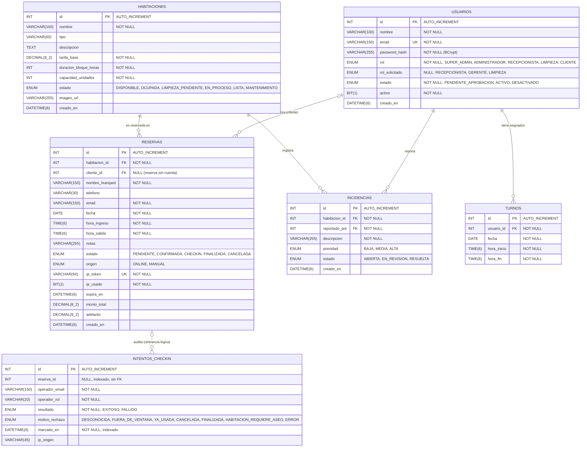

# Diagrama Entidad-Relación — Hotel Wimbledon

Esquema **leído de la base de datos real** (MySQL 8, base `hotel_wimbledon`) desde
`information_schema`: columnas, tipos, nulabilidad, claves primarias, únicas, foráneas e índices.
Hibernate genera y mantiene este esquema a partir de las entidades JPA de
`com.wimbledon.backend.domain` (`spring.jpa.hibernate.ddl-auto=update`).

## Restricciones reales

| Tabla | Claves foráneas | Únicas | Índices adicionales |
|---|---|---|---|
| `usuarios` | — | `email` | — |
| `habitaciones` | — | — | — |
| `reservas` | `habitacion_id → habitaciones.id`, `cliente_id → usuarios.id` | `qr_token` | — |
| `incidencias` | `habitacion_id → habitaciones.id`, `reportado_por → usuarios.id` | — | — |
| `turnos` | `usuario_id → usuarios.id` | — | — |
| `intentos_checkin` | — | — | `idx_intentos_checkin_reserva (reserva_id)`, `idx_intentos_checkin_marcado (marcado_en)` |

## Notas

- **Roles como enum, no como tabla.** No existe una tabla `roles`: el rol es una columna `ENUM` en `usuarios`.
- **`intentos_checkin` no tiene FK** hacia `reservas` a propósito: es un registro de auditoría
  append-only que debe sobrevivir al ciclo de vida de la reserva. La relación es solo lógica
  (línea punteada).
- **`reservas.cliente_id` es opcional**: una reserva puede existir asociada solo al email del huésped.
- **Sin valores `DEFAULT` en la base.** Los valores iniciales (`estado = DISPONIBLE`,
  `duracion_bloque_horas = 6`, `qr_usado = false`, `adelanto = 0`, etc.) los asigna Java con
  `@Builder.Default`, y `creado_en`/`marcado_en` los asigna el callback `@PrePersist`.
- Los booleanos de Java (`Boolean`) se guardan como `BIT(1)`; los `LocalDateTime`/`LocalTime`, con
  precisión de microsegundos (`DATETIME(6)`/`TIME(6)`).
