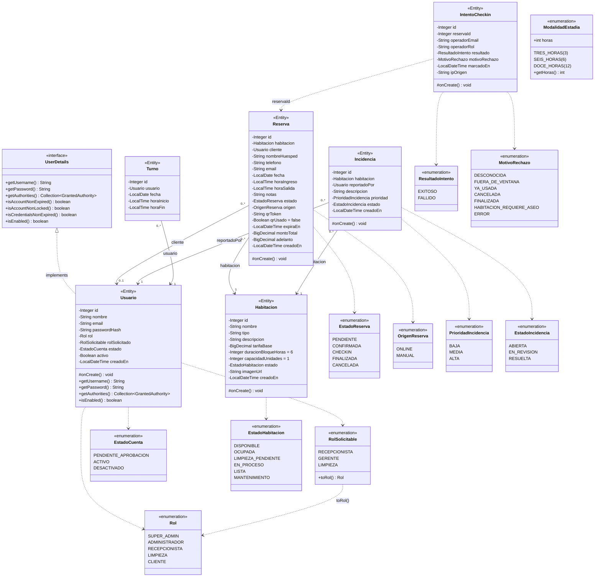

# Diagrama de Clases UML (POO) — Entidades del backend Java

Paquete `com.wimbledon.backend.domain` y `com.wimbledon.backend.domain.enums`.
Los getters/setters, constructores y `builder()` los genera Lombok
(`@Getter @Setter @NoArgsConstructor @AllArgsConstructor @Builder`) y se omiten.

## Notas

- **`Usuario` implementa `UserDetails`** (Spring Security): el email actúa como username, el rol se
  expone como autoridad `ROLE_<ROL>` y `isEnabled()` exige `estado == ACTIVO && activo`.
- **Asociaciones unidireccionales**: todas son `@ManyToOne(fetch = LAZY)` desde el lado "muchos";
  ninguna entidad tiene colecciones `@OneToMany` de vuelta.
- **`IntentoCheckin` es deliberadamente desacoplado**: guarda `reservaId` como `Integer` y
  `operadorRol` como `String` (no como enum `Rol`) para que el registro de auditoría no dependa
  del ciclo de vida de `Reserva` ni de cambios futuros en `Rol`.
- **`ModalidadEstadia`** no se persiste en ninguna entidad; lo usan `CrearReservaRequest` y `TarifaService`
  para validar las duraciones permitidas (3, 6 y 12 horas).
- Cada entidad con `creadoEn`/`marcadoEn` lo asigna en su callback `@PrePersist onCreate()`.
